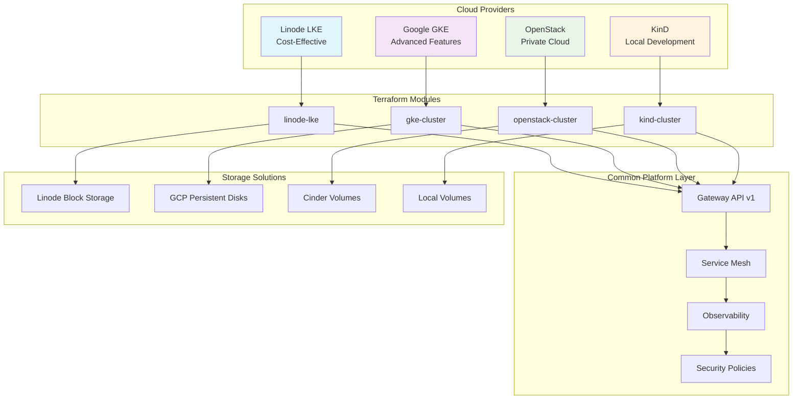

# ☁️ Multi-Cloud Setup Guide

Deploy Gateway API and Service Mesh infrastructure to Linode, Google Cloud, OpenStack, or local KinD.

## **🌐 Multi-Cloud Architecture Overview**



## **🏗️ Deployment Decision Matrix**

```ascii
┌─────────────────────────────────────────────────────────────────┐
│                    CLOUD PROVIDER COMPARISON                   │
├─────────────────┬─────────────┬─────────────┬─────────────────┤
│    Provider     │   Use Case  │    Cost     │   Complexity    │
├─────────────────┼─────────────┼─────────────┼─────────────────┤
│  Linode LKE     │ Production  │    Low      │     Simple      │
│  • Simple setup │ • SMB/Startup│ • $30/month │ • 5 min setup  │
│  • Great support│ • Regional  │ • Predictable│ • Auto-scaling │
│  • Block storage│ • Cost-opt  │ • No hidden │ • HA available │
├─────────────────┼─────────────┼─────────────┼─────────────────┤
│  Google GKE     │ Enterprise  │   Medium    │    Advanced     │
│  • Gateway API  │ • Global    │ • $100/month│ • Complex IAM   │
│  • Workload ID  │ • AI/ML     │ • Usage-based│ • Many options │
│  • Advanced net │ • Compliance│ • Credits   │ • Learning curve│
├─────────────────┼─────────────┼─────────────┼─────────────────┤
│  OpenStack      │ Private     │   Variable  │      High       │
│  • Full control │ • On-premise│ • Hardware  │ • Expert needed │
│  • Compliance   │ • Regulated │ • OpEx/CapEx│ • Custom setup  │
│  • Customizable │ • Security  │ • Licensing │ • Maintenance   │
├─────────────────┼─────────────┼─────────────┼─────────────────┤
│  KinD (Local)   │ Development │    Free     │     Minimal     │
│  • Local dev    │ • Testing   │ • No cost   │ • Docker only   │
│  • CI/CD        │ • Learning  │ • Local HW  │ • Quick start   │
│  • Prototyping  │ • Demos     │ • No limits │ • Full features │
└─────────────────┴─────────────┴─────────────┴─────────────────┘
```

---

## 🔵 Linode LKE

**Best for:** Cost-effective production, straightforward pricing, regional deployments

### Prerequisites

```bash
# Install Linode CLI (optional)
pip install linode-cli

# Get API token
# https://cloud.linode.com/profile/tokens

export LINODE_TOKEN="your-linode-token"
```

### Terraform Configuration

**terraform/linode/main.tf**

```hcl
terraform {
  required_version = ">= 1.6.0"
  required_providers {
    linode = {
      source  = "linode/linode"
      version = "~> 2.9"
    }
  }
}

provider "linode" {
  token = var.linode_token
}

resource "linode_lke_cluster" "gateway_mesh" {
  label       = var.cluster_name
  k8s_version = "1.28"
  region      = var.region

  pool {
    type  = var.node_type
    count = var.node_count
    
    autoscaler {
      min = var.min_nodes
      max = var.max_nodes
    }
  }

  tags = [
    "production",
    "gateway-api",
    "service-mesh",
    var.environment
  ]
}

resource "local_file" "kubeconfig" {
  content  = base64decode(linode_lke_cluster.gateway_mesh.kubeconfig)
  filename = "${path.module}/kubeconfig"
}

output "cluster_id" {
  value = linode_lke_cluster.gateway_mesh.id
}

output "api_endpoints" {
  value = linode_lke_cluster.gateway_mesh.api_endpoints
}

output "kubeconfig_path" {
  value = abspath(local_file.kubeconfig.filename)
}
```

**terraform/linode/variables.tf**

```hcl
variable "linode_token" {
  description = "Linode API token"
  type        = string
  sensitive   = true
}

variable "cluster_name" {
  description = "LKE cluster name"
  type        = string
  default     = "gateway-mesh-prod"
}

variable "region" {
  description = "Linode region"
  type        = string
  default     = "us-east"
  # Options: us-east, us-west, eu-west, ap-south, etc.
}

variable "node_type" {
  description = "Linode instance type"
  type        = string
  default     = "g6-standard-4"  # 8GB RAM, 4 vCPU
  # Options: g6-standard-2, g6-standard-4, g6-standard-8
}

variable "node_count" {
  description = "Initial node count"
  type        = number
  default     = 3
}

variable "min_nodes" {
  description = "Minimum autoscaler nodes"
  type        = number
  default     = 3
}

variable "max_nodes" {
  description = "Maximum autoscaler nodes"
  type        = number
  default     = 10
}

variable "environment" {
  description = "Environment tag"
  type        = string
  default     = "production"
}
```

### Deployment

```bash
cd terraform/linode

# Initialize
terraform init

# Plan
terraform plan -out=tfplan

# Apply
terraform apply tfplan

# Get kubeconfig
export KUBECONFIG=$(terraform output -raw kubeconfig_path)

# Verify cluster
kubectl cluster-info
kubectl get nodes
```

### Install Gateway API + Service Mesh

```bash
# Deploy Gateway API
kubectl apply -f https://github.com/kubernetes-sigs/gateway-api/releases/download/v1.1.0/standard-install.yaml

# Install Istio
istioctl install --set profile=production -y

# Deploy monitoring
helm install prometheus prometheus-community/kube-prometheus-stack \
  --namespace monitoring --create-namespace

# Apply your configs
kubectl apply -f gateway-api/
kubectl apply -f service-mesh/
```

### Cost Optimization

```hcl
# Use spot instances for non-critical workloads
pool {
  type  = "g6-standard-4"
  count = 3
  
  # Add spot pool
}

# Smaller node type for dev
variable "node_type" {
  default = "g6-standard-2"  # 4GB RAM, 2 vCPU - $36/month
}
```

---

## 🔴 Google Cloud (GKE)

**Best for:** Enterprise features, global scale, advanced networking, native Gateway API support

### Prerequisites

```bash
# Install gcloud CLI
curl https://sdk.cloud.google.com | bash
exec -l $SHELL

# Authenticate
gcloud auth login
gcloud auth application-default login

# Set project
gcloud config set project YOUR_PROJECT_ID

export GOOGLE_PROJECT_ID="your-project-id"
export GOOGLE_REGION="us-central1"
```

### Terraform Configuration

**terraform/gke/main.tf**

```hcl
terraform {
  required_version = ">= 1.6.0"
  required_providers {
    google = {
      source  = "hashicorp/google"
      version = "~> 5.10"
    }
  }
}

provider "google" {
  project = var.project_id
  region  = var.region
}

# VPC Network
resource "google_compute_network" "vpc" {
  name                    = "${var.cluster_name}-vpc"
  auto_create_subnetworks = false
}

# Subnet with secondary ranges for pods and services
resource "google_compute_subnetwork" "subnet" {
  name          = "${var.cluster_name}-subnet"
  ip_cidr_range = "10.0.0.0/20"
  region        = var.region
  network       = google_compute_network.vpc.name

  secondary_ip_range {
    range_name    = "pods"
    ip_cidr_range = "10.4.0.0/14"
  }

  secondary_ip_range {
    range_name    = "services"
    ip_cidr_range = "10.8.0.0/20"
  }
}

# GKE Autopilot Cluster
resource "google_container_cluster" "gateway_mesh" {
  name     = var.cluster_name
  location = var.region

  # Enable Autopilot for hands-free management
  enable_autopilot = true

  network    = google_compute_network.vpc.name
  subnetwork = google_compute_subnetwork.subnet.name

  # Gateway API support
  gateway_api_config {
    channel = "CHANNEL_STANDARD"
  }

  # Workload Identity for GCP service integration
  workload_identity_config {
    workload_pool = "${var.project_id}.svc.id.goog"
  }

  # Network configuration
  ip_allocation_policy {
    cluster_secondary_range_name  = "pods"
    services_secondary_range_name = "services"
  }

  # Enable features
  addons_config {
    http_load_balancing {
      disabled = false
    }
    horizontal_pod_autoscaling {
      disabled = false
    }
  }

  # Master authorized networks (optional)
  master_authorized_networks_config {
    cidr_blocks {
      cidr_block   = "0.0.0.0/0"
      display_name = "All"
    }
  }

  # Logging and monitoring
  logging_config {
    enable_components = ["SYSTEM_COMPONENTS", "WORKLOADS"]
  }

  monitoring_config {
    enable_components = ["SYSTEM_COMPONENTS"]
    managed_prometheus {
      enabled = true
    }
  }
}

output "cluster_name" {
  value = google_container_cluster.gateway_mesh.name
}

output "cluster_endpoint" {
  value     = google_container_cluster.gateway_mesh.endpoint
  sensitive = true
}

output "get_credentials_command" {
  value = "gcloud container clusters get-credentials ${google_container_cluster.gateway_mesh.name} --region ${var.region} --project ${var.project_id}"
}
```

**terraform/gke/variables.tf**

```hcl
variable "project_id" {
  description = "GCP project ID"
  type        = string
}

variable "region" {
  description = "GCP region"
  type        = string
  default     = "us-central1"
  # Options: us-central1, us-east1, europe-west1, asia-northeast1
}

variable "cluster_name" {
  description = "GKE cluster name"
  type        = string
  default     = "gateway-mesh-gke"
}
```

### Deployment

```bash
cd terraform/gke

# Initialize
terraform init

# Plan
terraform plan -var="project_id=$GOOGLE_PROJECT_ID"

# Apply
terraform apply -var="project_id=$GOOGLE_PROJECT_ID" -auto-approve

# Get credentials
gcloud container clusters get-credentials gateway-mesh-gke \
  --region us-central1 \
  --project $GOOGLE_PROJECT_ID

# Verify
kubectl get nodes
kubectl get ns
```

### GKE-Specific Features

```bash
# Use Google Cloud Load Balancer with Gateway API
cat <<EOF | kubectl apply -f -
apiVersion: gateway.networking.k8s.io/v1
kind: GatewayClass
metadata:
  name: gke-l7-global-external-managed
spec:
  controllerName: networking.gke.io/gateway
EOF

# Enable Cloud Armor for DDoS protection
# Add to Gateway annotations:
# networking.gke.io/backend-config: "cloud-armor-config"
```

---

## 🟠 OpenStack

**Best for:** Private cloud, regulatory compliance, on-premises, full infrastructure control

### Prerequisites

```bash
# Source OpenStack credentials
source openrc.sh
# Or set manually:
export OS_AUTH_URL="https://openstack.example.com:5000/v3"
export OS_PROJECT_NAME="your-project"
export OS_USERNAME="your-username"
export OS_PASSWORD="your-password"
export OS_REGION_NAME="RegionOne"

# Install OpenStack CLI
pip install python-openstackclient
pip install python-magnumclient

# Verify connectivity
openstack catalog list
```

### Terraform Configuration

**terraform/openstack/main.tf**

```hcl
terraform {
  required_version = ">= 1.6.0"
  required_providers {
    openstack = {
      source  = "terraform-provider-openstack/openstack"
      version = "~> 1.53"
    }
  }
}

provider "openstack" {
  # Credentials from environment variables or openrc.sh
}

# Find cluster template
data "openstack_containerinfra_clustertemplate_v1" "template" {
  name = var.cluster_template_name
}

# Create Kubernetes cluster with Magnum
resource "openstack_containerinfra_cluster_v1" "gateway_mesh" {
  name                = var.cluster_name
  cluster_template_id = data.openstack_containerinfra_clustertemplate_v1.template.id
  
  master_count = var.master_count
  node_count   = var.node_count
  
  keypair = var.keypair_name
  
  labels = {
    kube_tag                  = "v1.28.0"
    master_lb_enabled         = "true"
    auto_scaling_enabled      = "true"
    min_node_count            = var.min_nodes
    max_node_count            = var.max_nodes
    cloud_provider_tag        = "v1.28.0"
    heat_container_agent_tag  = "train-stable-1"
  }

  merge_labels = true

  timeouts {
    create = "30m"
    update = "30m"
    delete = "30m"
  }
}

# Wait for cluster to be ready
resource "null_resource" "wait_for_cluster" {
  depends_on = [openstack_containerinfra_cluster_v1.gateway_mesh]

  provisioner "local-exec" {
    command = "sleep 60"
  }
}

# Get kubeconfig
data "openstack_containerinfra_cluster_v1" "gateway_mesh_data" {
  name       = openstack_containerinfra_cluster_v1.gateway_mesh.name
  depends_on = [null_resource.wait_for_cluster]
}

resource "local_file" "kubeconfig" {
  content  = data.openstack_containerinfra_cluster_v1.gateway_mesh_data.kubeconfig.raw_config
  filename = "${path.module}/kubeconfig"
}

output "cluster_id" {
  value = openstack_containerinfra_cluster_v1.gateway_mesh.id
}

output "kubeconfig_path" {
  value = abspath(local_file.kubeconfig.filename)
}

output "api_address" {
  value = openstack_containerinfra_cluster_v1.gateway_mesh.api_address
}
```

**terraform/openstack/variables.tf**

```hcl
variable "cluster_name" {
  description = "Cluster name"
  type        = string
  default     = "gateway-mesh-openstack"
}

variable "cluster_template_name" {
  description = "Magnum cluster template name"
  type        = string
  default     = "kubernetes-1.28"
}

variable "keypair_name" {
  description = "OpenStack keypair name for SSH access"
  type        = string
}

variable "master_count" {
  description = "Number of master nodes"
  type        = number
  default     = 3
}

variable "node_count" {
  description = "Number of worker nodes"
  type        = number
  default     = 5
}

variable "min_nodes" {
  description = "Minimum nodes for autoscaling"
  type        = string
  default     = "3"
}

variable "max_nodes" {
  description = "Maximum nodes for autoscaling"
  type        = string
  default     = "10"
}
```

### Deployment

```bash
cd terraform/openstack

# Create SSH keypair (if needed)
openstack keypair create gateway-mesh-key > ~/.ssh/gateway-mesh-key.pem
chmod 600 ~/.ssh/gateway-mesh-key.pem

# Initialize
terraform init

# Plan
terraform plan -var="keypair_name=gateway-mesh-key"

# Apply
terraform apply -var="keypair_name=gateway-mesh-key" -auto-approve

# Get kubeconfig
export KUBECONFIG=$(terraform output -raw kubeconfig_path)

# Verify
kubectl get nodes
kubectl cluster-info
```

---

## 🟢 KinD (Local Development)

**Best for:** Local development, CI/CD testing, cost-free experimentation

### Quick Setup

```bash
# One-command deployment
./transform.sh kind gateway-dev
```

### Manual Configuration

```bash
# Create cluster with custom config
cat <<EOF | kind create cluster --config=-
kind: Cluster
apiVersion: kind.x-k8s.io/v1alpha4
name: gateway-dev
nodes:
- role: control-plane
  kubeadmConfigPatches:
  - |
    kind: InitConfiguration
    nodeRegistration:
      kubeletExtraArgs:
        node-labels: "ingress-ready=true"
  extraPortMappings:
  - containerPort: 80
    hostPort: 80
    protocol: TCP
  - containerPort: 443
    hostPort: 443
    protocol: TCP
  - containerPort: 15021
    hostPort: 15021
    protocol: TCP
- role: worker
  extraMounts:
  - hostPath: /tmp/kind-storage
    containerPath: /var/local-path-provisioner
- role: worker
EOF

# Verify
kubectl cluster-info --context kind-gateway-dev
```

### Multi-Node Setup for Testing

```bash
cat <<EOF | kind create cluster --config=-
kind: Cluster
apiVersion: kind.x-k8s.io/v1alpha4
name: multi-node-test
nodes:
- role: control-plane
- role: worker
- role: worker
- role: worker
EOF
```

### Load Docker Images into KinD

```bash
# Build custom image
docker build -t my-app:v1.0 .

# Load into KinD
kind load docker-image my-app:v1.0 --name gateway-dev

# Use in deployment
kubectl set image deployment/my-app my-app=my-app:v1.0
```

---

## 🔄 Multi-Cloud Management

### Unified Terraform Module

**terraform/modules/kubernetes-cluster/main.tf**

```hcl
variable "cloud_provider" {
  description = "Cloud provider: linode, gke, openstack, or kind"
  type        = string
}

module "linode_cluster" {
  count  = var.cloud_provider == "linode" ? 1 : 0
  source = "../linode"
  # ... variables
}

module "gke_cluster" {
  count  = var.cloud_provider == "gke" ? 1 : 0
  source = "../gke"
  # ... variables
}

module "openstack_cluster" {
  count  = var.cloud_provider == "openstack" ? 1 : 0
  source = "../openstack"
  # ... variables
}
```

### Environment-Specific Configs

```bash
# environments/dev/terraform.tfvars
cloud_provider = "kind"

# environments/staging/terraform.tfvars
cloud_provider = "linode"
region = "us-east"
node_type = "g6-standard-2"

# environments/production/terraform.tfvars
cloud_provider = "gke"
project_id = "prod-project"
region = "us-central1"
```

---

## 📊 Cost Comparison

| Provider | Small (3 nodes) | Medium (5 nodes) | Large (10 nodes) |
|----------|----------------|------------------|------------------|
| **Linode LKE** | ~$108/mo | ~$180/mo | ~$360/mo |
| **Google GKE** | ~$220/mo | ~$370/mo | ~$740/mo |
| **OpenStack** | Hardware cost | Hardware cost | Hardware cost |
| **KinD** | Free | Free | Free |

*Prices are estimates for g6-standard-4 (Linode) or e2-standard-4 (GKE) equivalent*

---

## ✅ Post-Deployment Checklist

```bash
# 1. Verify cluster
kubectl get nodes
kubectl get namespaces

# 2. Deploy Gateway API
kubectl apply -f https://github.com/kubernetes-sigs/gateway-api/releases/download/v1.1.0/standard-install.yaml

# 3. Install service mesh
istioctl install --set profile=production -y

# 4. Deploy monitoring
helm install prometheus prometheus-community/kube-prometheus-stack -n monitoring --create-namespace

# 5. Apply your configurations
kubectl apply -f gateway-api/
kubectl apply -f service-mesh/
kubectl apply -f transformations/

# 6. Verify deployments
kubectl get gateways,httproutes -A
kubectl get pods -n istio-system
kubectl get pods -n monitoring
```

---

**Next:** Configure Gateway API in [GATEWAY-API.md](GATEWAY-API.md)
