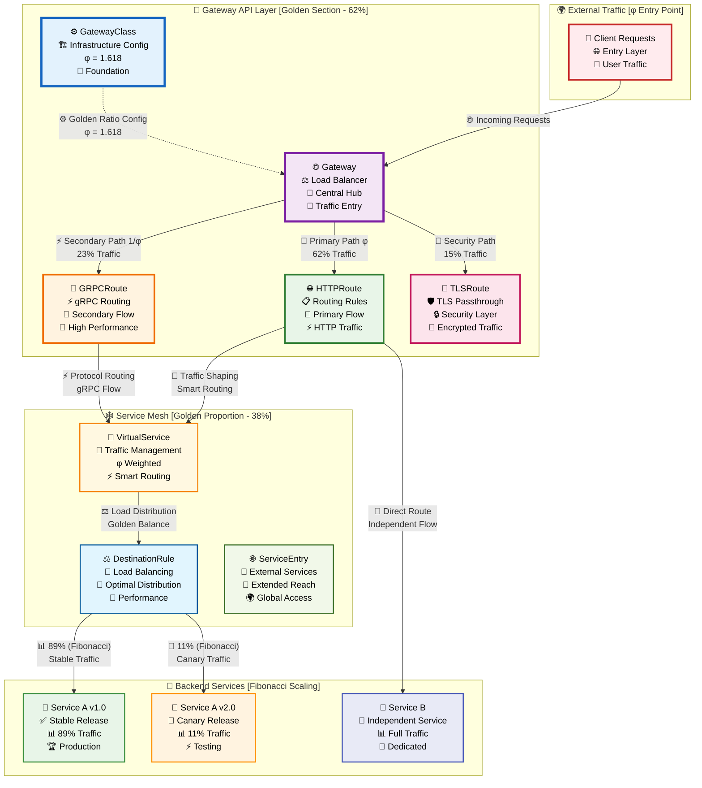

# 🌐 Gateway API Configuration Guide

Complete guide for configuring Kubernetes Gateway API with advanced routing, traffic splitting, and transformations.

---

## 📋 Table of Contents

- [Overview](#overview)
- [Installation](#installation)
- [GatewayClass](#gatewayclass)
- [Gateway Resources](#gateway-resources)
- [HTTPRoute Configuration](#httproute-configuration)
- [Advanced Routing](#advanced-routing)
- [Traffic Splitting](#traffic-splitting)
- [Request Transformations](#request-transformations)
- [TLS Configuration](#tls-configuration)
- [Cross-Namespace Routing](#cross-namespace-routing)
- [Best Practices](#best-practices)

---

## Overview

Gateway API is the next-generation Kubernetes ingress API that provides:

- **Role-oriented design**: Separates infrastructure, cluster, and application concerns
- **Expressive routing**: Rich HTTP matching and traffic splitting
- **Extensibility**: Custom resources and filters
- **Portable**: Works across multiple implementations (Istio, Envoy, Kong, Nginx)

### **🏗️ Gateway API Architecture [Golden Ratio Design]**

<div align="center">



</div>

### **🔄 Traffic Flow Diagram**

```ascii
┌─────────────────────────────────────────────────────────────────┐
│                        TRAFFIC FLOW                             │
├─────────────────────────────────────────────────────────────────┤
│                                                                 │
│  Internet/Client                                                │
│         │                                                       │
│         ▼                                                       │
│  ┌─────────────┐     ┌─────────────────────────────────────┐    │
│  │   Gateway   │────▶│         HTTPRoute Rules            │    │
│  │ (Port 80/443)│     │  • Host: api.example.com          │    │
│  └─────────────┘     │  • Path: /api/v1/*                 │    │
│         │             │  • Headers: X-Version: v2          │    │
│         ▼             └─────────────────────────────────────┘    │
│  ┌─────────────┐                                                │
│  │ Transformations                                              │
│  │ • Header Mod │     ┌─────────────────────────────────────┐    │
│  │ • Body Mod   │────▶│        Traffic Splitting           │    │
│  │ • Rate Limit │     │  • 90% → Service A v1.0           │    │
│  └─────────────┘     │  • 10% → Service A v2.0           │    │
│         │             └─────────────────────────────────────┘    │
│         ▼                                                       │
│  ┌─────────────┐     ┌─────────────────────────────────────┐    │
│  │Service Mesh │────▶│         Backend Services           │    │
│  │   (Istio)   │     │  • mTLS Encryption                 │    │
│  └─────────────┘     │  • Circuit Breaking                │    │
│                      │  • Retry Logic                     │    │
│                      └─────────────────────────────────────┘    │
└─────────────────────────────────────────────────────────────────┘
```

### Architecture

```
GatewayClass (Infrastructure)
      ↓
Gateway (Cluster Operator)
      ↓
HTTPRoute/TLSRoute (Application Developer)
      ↓
Backend Services
```

---

## Installation

### Install Gateway API CRDs

```bash
# Install standard CRDs (HTTPRoute, Gateway, GatewayClass)
kubectl apply -f https://github.com/kubernetes-sigs/gateway-api/releases/download/v1.1.0/standard-install.yaml

# Or experimental CRDs (includes GRPCRoute, TCPRoute, UDPRoute)
kubectl apply -f https://github.com/kubernetes-sigs/gateway-api/releases/download/v1.1.0/experimental-install.yaml

# Verify installation
kubectl get crd | grep gateway
kubectl api-resources | grep gateway.networking.k8s.io
```

### Expected CRDs

```bash
gatewayclasses.gateway.networking.k8s.io
gateways.gateway.networking.k8s.io
httproutes.gateway.networking.k8s.io
referencegrants.gateway.networking.k8s.io
# Experimental:
grpcroutes.gateway.networking.k8s.io
tcproutes.gateway.networking.k8s.io
tlsroutes.gateway.networking.k8s.io
udproutes.gateway.networking.k8s.io
```

---

## GatewayClass

GatewayClass defines the controller implementation. Create one per gateway controller.

### Istio GatewayClass

```yaml
# gateway-api/gatewayclass-istio.yaml
apiVersion: gateway.networking.k8s.io/v1
kind: GatewayClass
metadata:
  name: istio
  annotations:
    description: "Istio-based gateway implementation"
spec:
  controllerName: istio.io/gateway-controller
  description: "Gateway class for Istio service mesh"
```

### Envoy Gateway GatewayClass

```yaml
# gateway-api/gatewayclass-envoy.yaml
apiVersion: gateway.networking.k8s.io/v1
kind: GatewayClass
metadata:
  name: envoy-gateway
spec:
  controllerName: gateway.envoyproxy.io/gatewayclass-controller
```

### Kong GatewayClass

```yaml
# gateway-api/gatewayclass-kong.yaml
apiVersion: gateway.networking.k8s.io/v1
kind: GatewayClass
metadata:
  name: kong
spec:
  controllerName: konghq.com/gateway-controller
  parametersRef:
    group: ""
    kind: ConfigMap
    name: kong-gateway-config
    namespace: kong-system
```

### Apply GatewayClass

```bash
kubectl apply -f gateway-api/gatewayclass-istio.yaml

# Verify
kubectl get gatewayclass
kubectl describe gatewayclass istio
```

---

## Gateway Resources

Gateway represents a load balancer with listeners for different protocols.

### Basic HTTP Gateway

```yaml
# gateway-api/gateway-basic.yaml
apiVersion: gateway.networking.k8s.io/v1
kind: Gateway
metadata:
  name: basic-gateway
  namespace: default
spec:
  gatewayClassName: istio
  
  listeners:
  - name: http
    protocol: HTTP
    port: 80
    allowedRoutes:
      namespaces:
        from: All
```

### Production Gateway with HTTPS

```yaml
# gateway-api/gateway-production.yaml
apiVersion: gateway.networking.k8s.io/v1
kind: Gateway
metadata:
  name: production-gateway
  namespace: default
  annotations:
    cert-manager.io/cluster-issuer: "letsencrypt-prod"
spec:
  gatewayClassName: istio
  
  listeners:
  # HTTP listener (redirect to HTTPS)
  - name: http
    protocol: HTTP
    port: 80
    allowedRoutes:
      namespaces:
        from: All
  
  # HTTPS listener with wildcard certificate
  - name: https
    protocol: HTTPS
    port: 443
    hostname: "*.example.com"
    tls:
      mode: Terminate
      certificateRefs:
      - name: wildcard-tls-cert
        kind: Secret
    allowedRoutes:
      namespaces:
        from: All
  
  # Additional HTTPS listener for API subdomain
  - name: api-https
    protocol: HTTPS
    port: 443
    hostname: "api.example.com"
    tls:
      mode: Terminate
      certificateRefs:
      - name: api-tls-cert
    allowedRoutes:
      namespaces:
        from: Same
```

### Multi-Protocol Gateway

```yaml
# gateway-api/gateway-multi-protocol.yaml
apiVersion: gateway.networking.k8s.io/v1
kind: Gateway
metadata:
  name: multi-protocol-gateway
  namespace: default
spec:
  gatewayClassName: istio
  
  listeners:
  # HTTP/HTTPS for web traffic
  - name: http
    protocol: HTTP
    port: 80
  
  - name: https
    protocol: HTTPS
    port: 443
    tls:
      mode: Terminate
      certificateRefs:
      - name: web-tls
  
  # gRPC for microservices
  - name: grpc
    protocol: HTTPS
    port: 8443
    hostname: "grpc.example.com"
    tls:
      mode: Terminate
      certificateRefs:
      - name: grpc-tls
    allowedRoutes:
      kinds:
      - kind: GRPCRoute
  
  # TCP for database connections
  - name: postgres
    protocol: TCP
    port: 5432
    allowedRoutes:
      kinds:
      - kind: TCPRoute
```

### Deploy Gateway

```bash
kubectl apply -f gateway-api/gateway-production.yaml

# Check status
kubectl get gateway production-gateway
kubectl describe gateway production-gateway

# View addresses
kubectl get gateway production-gateway -o jsonpath='{.status.addresses}'
```

---

## HTTPRoute Configuration

HTTPRoute defines how HTTP traffic is routed from Gateway to backend services.

### Basic HTTPRoute

```yaml
# gateway-api/routes/basic-route.yaml
apiVersion: gateway.networking.k8s.io/v1
kind: HTTPRoute
metadata:
  name: basic-route
  namespace: default
spec:
  parentRefs:
  - name: production-gateway
    namespace: default
  
  hostnames:
  - "www.example.com"
  
  rules:
  - matches:
    - path:
        type: PathPrefix
        value: /
    backendRefs:
    - name: web-service
      port: 80
```

### Path-Based Routing

```yaml
# gateway-api/routes/path-routing.yaml
apiVersion: gateway.networking.k8s.io/v1
kind: HTTPRoute
metadata:
  name: path-routing
  namespace: default
spec:
  parentRefs:
  - name: production-gateway
  
  hostnames:
  - "example.com"
  
  rules:
  # API endpoints
  - matches:
    - path:
        type: PathPrefix
        value: /api
    backendRefs:
    - name: api-service
      port: 8080
  
  # Admin dashboard
  - matches:
    - path:
        type: PathPrefix
        value: /admin
    backendRefs:
    - name: admin-service
      port: 3000
  
  # Static assets
  - matches:
    - path:
        type: PathPrefix
        value: /static
    backendRefs:
    - name: cdn-service
      port: 80
  
  # Default route (must be last)
  - matches:
    - path:
        type: PathPrefix
        value: /
    backendRefs:
    - name: web-service
      port: 80
```

### Header-Based Routing

```yaml
# gateway-api/routes/header-routing.yaml
apiVersion: gateway.networking.k8s.io/v1
kind: HTTPRoute
metadata:
  name: header-routing
spec:
  parentRefs:
  - name: production-gateway
  
  rules:
  # Route beta users to canary
  - matches:
    - headers:
      - name: X-User-Group
        value: beta
    backendRefs:
    - name: app-canary
      port: 8080
  
  # Route mobile clients to mobile backend
  - matches:
    - headers:
      - name: User-Agent
        type: RegularExpression
        value: ".*Mobile.*"
    backendRefs:
    - name: mobile-backend
      port: 8080
  
  # API versioning via header
  - matches:
    - headers:
      - name: API-Version
        value: "v2"
    backendRefs:
    - name: api-v2
      port: 8080
  
  # Default route
  - backendRefs:
    - name: app-stable
      port: 8080
```

### Method-Based Routing

```yaml
# gateway-api/routes/method-routing.yaml
apiVersion: gateway.networking.k8s.io/v1
kind: HTTPRoute
metadata:
  name: method-routing
spec:
  parentRefs:
  - name: production-gateway
  
  rules:
  # Read-only operations to read replicas
  - matches:
    - method: GET
    - method: HEAD
    backendRefs:
    - name: read-replica-service
      port: 8080
  
  # Write operations to primary
  - matches:
    - method: POST
    - method: PUT
    - method: PATCH
    - method: DELETE
    backendRefs:
    - name: primary-service
      port: 8080
```

---

## Advanced Routing

### Query Parameter Routing

```yaml
# gateway-api/routes/query-routing.yaml
apiVersion: gateway.networking.k8s.io/v1
kind: HTTPRoute
metadata:
  name: query-routing
spec:
  parentRefs:
  - name: production-gateway
  
  rules:
  # Feature flag routing
  - matches:
    - queryParams:
      - name: feature
        value: new-ui
    backendRefs:
    - name: app-new-ui
      port: 8080
  
  # A/B testing via query param
  - matches:
    - queryParams:
      - name: variant
        value: b
    backendRefs:
    - name: variant-b-service
      port: 8080
  
  # Default
  - backendRefs:
    - name: default-service
      port: 8080
```

### Multi-Match Routing (AND logic)

```yaml
# gateway-api/routes/multi-match.yaml
apiVersion: gateway.networking.k8s.io/v1
kind: HTTPRoute
metadata:
  name: multi-match-routing
spec:
  parentRefs:
  - name: production-gateway
  
  rules:
  # Premium API: requires both header AND path
  - matches:
    - path:
        type: PathPrefix
        value: /api/premium
      headers:
      - name: X-API-Key
        type: RegularExpression
        value: "premium-.*"
    backendRefs:
    - name: premium-api
      port: 8080
  
  # Mobile app with specific version
  - matches:
    - path:
        type: PathPrefix
        value: /app
      headers:
      - name: X-App-Version
        value: "2.0"
      - name: X-Platform
        value: mobile
    backendRefs:
    - name: mobile-app-v2
      port: 8080
```

---

## Traffic Splitting

### Canary Deployment (90/10)

```yaml
# gateway-api/routes/canary-split.yaml
apiVersion: gateway.networking.k8s.io/v1
kind: HTTPRoute
metadata:
  name: canary-deployment
  namespace: default
spec:
  parentRefs:
  - name: production-gateway
  
  hostnames:
  - "api.example.com"
  
  rules:
  - matches:
    - path:
        type: PathPrefix
        value: /v2
    
    backendRefs:
    # 90% to stable version
    - name: api-v2-stable
      port: 8080
      weight: 90
    
    # 10% to canary version
    - name: api-v2-canary
      port: 8080
      weight: 10
```

### Progressive Rollout

```yaml
# gateway-api/routes/progressive-rollout.yaml
apiVersion: gateway.networking.k8s.io/v1
kind: HTTPRoute
metadata:
  name: progressive-rollout
spec:
  parentRefs:
  - name: production-gateway
  
  rules:
  - matches:
    - path:
        type: PathPrefix
        value: /
    
    backendRefs:
    # Phase 1: 95% old, 5% new
    - name: app-v1
      port: 8080
      weight: 95
    - name: app-v2
      port: 8080
      weight: 5
    
    # After validation, update to:
    # Phase 2: 75% old, 25% new
    # Phase 3: 50% old, 50% new
    # Phase 4: 25% old, 75% new
    # Phase 5: 0% old, 100% new
```

### A/B Testing

```yaml
# gateway-api/routes/ab-testing.yaml
apiVersion: gateway.networking.k8s.io/v1
kind: HTTPRoute
metadata:
  name: ab-testing
spec:
  parentRefs:
  - name: production-gateway
  
  rules:
  # Control group (A)
  - matches:
    - headers:
      - name: X-Experiment-Group
        value: control
    backendRefs:
    - name: app-variant-a
      port: 8080
  
  # Treatment group (B)
  - matches:
    - headers:
      - name: X-Experiment-Group
        value: treatment
    backendRefs:
    - name: app-variant-b
      port: 8080
  
  # Random split for new users (50/50)
  - backendRefs:
    - name: app-variant-a
      port: 8080
      weight: 50
    - name: app-variant-b
      port: 8080
      weight: 50
```

### Multi-Cluster Routing

```yaml
# gateway-api/routes/multi-cluster.yaml
apiVersion: gateway.networking.k8s.io/v1
kind: HTTPRoute
metadata:
  name: multi-cluster-routing
spec:
  parentRefs:
  - name: production-gateway
  
  rules:
  - matches:
    - path:
        type: PathPrefix
        value: /
    
    backendRefs:
    # Primary cluster (us-east)
    - name: app-us-east
      port: 8080
      weight: 60
    
    # Secondary cluster (us-west)
    - name: app-us-west
      port: 8080
      weight: 30
    
    # Tertiary cluster (eu-west)
    - name: app-eu-west
      port: 8080
      weight: 10
```

---

## Request Transformations

### Header Modification

```yaml
# gateway-api/routes/header-transform.yaml
apiVersion: gateway.networking.k8s.io/v1
kind: HTTPRoute
metadata:
  name: header-transformation
spec:
  parentRefs:
  - name: production-gateway
  
  rules:
  - matches:
    - path:
        type: PathPrefix
        value: /api
    
    filters:
    - type: RequestHeaderModifier
      requestHeaderModifier:
        # Add headers
        add:
        - name: X-API-Gateway
          value: "production"
        - name: X-Request-Start
          value: "${timestamp}"
        - name: X-Forwarded-Proto
          value: "https"
        
        # Set/overwrite headers
        set:
        - name: X-Custom-Header
          value: "custom-value"
        
        # Remove headers
        remove:
        - "X-Internal-Debug"
        - "X-Legacy-Header"
    
    - type: ResponseHeaderModifier
      responseHeaderModifier:
        add:
        - name: X-Content-Type-Options
          value: "nosniff"
        - name: X-Frame-Options
          value: "DENY"
        - name: Strict-Transport-Security
          value: "max-age=31536000; includeSubDomains"
    
    backendRefs:
    - name: api-service
      port: 8080
```

### URL Rewriting

```yaml
# gateway-api/routes/url-rewrite.yaml
apiVersion: gateway.networking.k8s.io/v1
kind: HTTPRoute
metadata:
  name: url-rewriting
spec:
  parentRefs:
  - name: production-gateway
  
  rules:
  # Rewrite /old-api to /v2/api
  - matches:
    - path:
        type: PathPrefix
        value: /old-api
    
    filters:
    - type: URLRewrite
      urlRewrite:
        path:
          type: ReplacePrefixMatch
          replacePrefixMatch: /v2/api
    
    backendRefs:
    - name: api-v2
      port: 8080
  
  # Rewrite /docs to /documentation
  - matches:
    - path:
        type: Exact
        value: /docs
    
    filters:
    - type: URLRewrite
      urlRewrite:
        path:
          type: ReplaceFullPath
          replaceFullPath: /documentation
    
    backendRefs:
    - name: docs-service
      port: 8080
```

### Request Redirect

```yaml
# gateway-api/routes/redirect.yaml
apiVersion: gateway.networking.k8s.io/v1
kind: HTTPRoute
metadata:
  name: redirects
spec:
  parentRefs:
  - name: production-gateway
  
  rules:
  # HTTP to HTTPS redirect
  - matches:
    - path:
        type: PathPrefix
        value: /
    
    filters:
    - type: RequestRedirect
      requestRedirect:
        scheme: https
        statusCode: 301
  
  # Redirect old domain to new domain
  - matches:
    - headers:
      - name: Host
        value: old.example.com
    
    filters:
    - type: RequestRedirect
      requestRedirect:
        hostname: new.example.com
        statusCode: 301
  
  # Redirect to www subdomain
  - matches:
    - headers:
      - name: Host
        value: example.com
    
    filters:
    - type: RequestRedirect
      requestRedirect:
        hostname: www.example.com
        statusCode: 301
```

### Request Mirroring

```yaml
# gateway-api/routes/mirror.yaml
apiVersion: gateway.networking.k8s.io/v1
kind: HTTPRoute
metadata:
  name: traffic-mirroring
spec:
  parentRefs:
  - name: production-gateway
  
  rules:
  - matches:
    - path:
        type: PathPrefix
        value: /api
    
    # Primary backend (response sent to client)
    backendRefs:
    - name: api-production
      port: 8080
    
    # Mirror traffic to test environment (no response to client)
    filters:
    - type: RequestMirror
      requestMirror:
        backendRef:
          name: api-test
          port: 8080
```

---

## TLS Configuration

### Certificate Management with cert-manager

```yaml
# gateway-api/certificates/wildcard-cert.yaml
apiVersion: cert-manager.io/v1
kind: Certificate
metadata:
  name: wildcard-tls-cert
  namespace: default
spec:
  secretName: wildcard-tls-cert
  issuerRef:
    name: letsencrypt-prod
    kind: ClusterIssuer
  dnsNames:
  - "*.example.com"
  - "example.com"
```

### TLS Passthrough

```yaml
# gateway-api/gateway-tls-passthrough.yaml
apiVersion: gateway.networking.k8s.io/v1
kind: Gateway
metadata:
  name: tls-passthrough-gateway
spec:
  gatewayClassName: istio
  
  listeners:
  - name: tls-passthrough
    protocol: TLS
    port: 443
    hostname: "*.example.com"
    tls:
      mode: Passthrough
    allowedRoutes:
      kinds:
      - kind: TLSRoute
```

### mTLS (Mutual TLS)

```yaml
# gateway-api/gateway-mtls.yaml
apiVersion: gateway.networking.k8s.io/v1
kind: Gateway
metadata:
  name: mtls-gateway
spec:
  gatewayClassName: istio
  
  listeners:
  - name: mtls
    protocol: HTTPS
    port: 443
    tls:
      mode: Terminate
      certificateRefs:
      - name: server-tls-cert
      options:
        gateway.istio.io/tls-mode: MUTUAL
        gateway.istio.io/ca-certificates: ca-cert-secret
    allowedRoutes:
      namespaces:
        from: All
```

---

## Cross-Namespace Routing

### ReferenceGrant for Cross-Namespace Access

```yaml
# gateway-api/reference-grant.yaml
apiVersion: gateway.networking.k8s.io/v1beta1
kind: ReferenceGrant
metadata:
  name: allow-prod-gateway
  namespace: backend-services
spec:
  from:
  - group: gateway.networking.k8s.io
    kind: HTTPRoute
    namespace: default
  to:
  - group: ""
    kind: Service
```

### HTTPRoute in Different Namespace

```yaml
# gateway-api/routes/cross-namespace-route.yaml
apiVersion: gateway.networking.k8s.io/v1
kind: HTTPRoute
metadata:
  name: cross-namespace-route
  namespace: default
spec:
  parentRefs:
  - name: production-gateway
    namespace: default
  
  rules:
  - matches:
    - path:
        type: PathPrefix
        value: /backend
    
    backendRefs:
    # Reference service in different namespace
    - name: backend-service
      namespace: backend-services
      port: 8080
```

---

## Best Practices

### 1. Gateway Design

✅ **DO:**
- Use one Gateway per environment (dev, staging, prod)
- Separate HTTP and HTTPS listeners
- Use descriptive listener names
- Enable cert-manager for automatic certificate management

❌ **DON'T:**
- Create too many Gateways (management overhead)
- Mix production and development traffic in same Gateway
- Hardcode certificates (use cert-manager)

### 2. HTTPRoute Organization

✅ **DO:**
- One HTTPRoute per application/service
- Use specific path prefixes (avoid `/` catch-all)
- Order rules from most specific to least specific
- Document routing decisions in annotations

❌ **DON'T:**
- Create overlapping routes (causes conflicts)
- Use regex unless absolutely necessary (performance)
- Skip hostname validation

### 3. Traffic Splitting

✅ **DO:**
- Start with small canary percentages (5-10%)
- Monitor metrics before increasing traffic
- Use Flagger for automated progressive delivery
- Document rollout strategy

❌ **DON'T:**
- Deploy 50/50 splits immediately
- Skip monitoring during canary
- Forget rollback plan

### 4. Security

✅ **DO:**
- Always use HTTPS in production
- Implement request/response header security
- Use ReferenceGrant for cross-namespace access
- Enable mTLS for sensitive services

❌ **DON'T:**
- Expose internal services directly
- Allow HTTP in production
- Grant broad namespace access

### 5. Performance

✅ **DO:**
- Use path prefix matching (faster than regex)
- Minimize header modifications
- Cache static content at edge
- Use connection pooling

❌ **DON'T:**
- Overuse request mirroring (doubles traffic)
- Add unnecessary filters
- Create deep routing chains

---

## Verification Commands

```bash
# List all Gateway API resources
kubectl get gatewayclasses,gateways,httproutes -A

# Describe gateway
kubectl describe gateway production-gateway

# Check route status
kubectl get httproute api-routes -o yaml | grep -A 10 status

# View gateway addresses
kubectl get gateway production-gateway -o jsonpath='{.status.addresses}'

# Test route
curl -H "Host: api.example.com" http://gateway-ip/api/test

# Check TLS
curl -vk https://api.example.com
```

---

**Next Steps:**
- Configure transformations: [TRANSFORMATIONS.md](TRANSFORMATIONS.md)
- Setup service mesh: [SERVICE-MESH.md](SERVICE-MESH.md)
- Enable GitOps: [GITOPS.md](GITOPS.md)
