# 📊 Monitoring & Observability Guide [Golden Ratio Design]

<div align="center">

**📈 Intelligent Metrics • 📝 Structured Logging • 🔍 Distributed Tracing • 🎯 AI-Powered Alerts**

*Complete observability stack with mathematically perfect proportions*

</div>

---

## 🎯 **Observability Overview [φ = 1.618 Architecture]**

<table>
<tr>
<td width="62%">

### **🏗️ Complete Observability Stack**
- **📈 Metrics**: Prometheus with golden ratio scraping intervals
- **📊 Visualization**: Grafana dashboards with φ-based layouts
- **📝 Logging**: Loki with structured log aggregation
- **🔍 Tracing**: Jaeger/Tempo for distributed request tracking
- **🚨 Alerting**: AlertManager with Fibonacci threshold scaling
- **🎯 SLO Monitoring**: Service level objectives with golden ratios

### **🎨 Golden Ratio Benefits**
- **Optimal Sampling**: φ-based metric collection reduces overhead
- **Natural Dashboards**: Visual layouts following mathematical harmony
- **Intelligent Alerting**: Fibonacci thresholds prevent alert fatigue
- **Efficient Storage**: Golden ratio retention policies optimize costs

</td>
<td width="38%">

### **⚡ Quick Setup**
```bash
# Deploy observability stack
kubectl apply -f monitoring/prometheus/
kubectl apply -f monitoring/grafana/
kubectl apply -f monitoring/loki/
kubectl apply -f monitoring/jaeger/

# Access dashboards
kubectl port-forward -n monitoring svc/grafana 3000:80
```

### **📊 Key Metrics**
- **Data Retention**: 89 days (Fibonacci)
- **Scrape Interval**: 21s (Fibonacci)
- **Alert Threshold**: φ-based scaling
- **Dashboard Load**: < 1.618s

</td>
</tr>
</table>

---

## 📊 **Observability Architecture [Golden Ratio φ = 1.618]**

```mermaid
graph TB
    subgraph MetricsLayer ["📊 Metrics Layer [φ Collection - 38%]"]
        Prometheus["📈 Prometheus<br/>Time Series Database<br/>φ Scraping: 21s intervals<br/>🎯 Golden Metrics Collection"]
        AlertManager["🚨 AlertManager<br/>Intelligent Alerting<br/>Fibonacci Thresholds<br/>📢 Smart Notifications"]
        Grafana["📊 Grafana<br/>Visualization Engine<br/>Golden Dashboards<br/>🎨 φ-based Layouts"]
    end
    
    subgraph LoggingLayer ["📝 Logging Layer [Golden Section - 62%]"]
        Loki["📝 Loki<br/>Log Aggregation<br/>Structured Storage<br/>🔍 Efficient Queries"]
        Promtail["🌊 Promtail<br/>Log Collection<br/>φ Buffer Management<br/>📦 Stream Processing"]
        LogQL["🔍 LogQL<br/>Query Engine<br/>Advanced Filtering<br/>⚡ Fast Search"]
    end
    
    subgraph TracingLayer ["🔍 Tracing Layer [Fibonacci Distribution]"]
        Jaeger["🔍 Jaeger<br/>Distributed Tracing<br/>Span Collection<br/>🕸️ Service Topology"]
        Tempo["⚡ Tempo<br/>Trace Storage<br/>High Performance<br/>🚀 Scalable Backend"]
        OpenTelemetry["📡 OpenTelemetry<br/>Instrumentation<br/>Universal Standards<br/>🌐 Multi-Language"]
    end
    
    subgraph ApplicationLayer ["🎯 Application Layer [Data Sources]"]
        Gateway["🚪 Gateway API<br/>Request Metrics<br/>📊 Traffic Patterns<br/>🌐 Entry Point"]
        ServiceMesh["🕸️ Service Mesh<br/>Inter-service Metrics<br/>🔀 Proxy Telemetry<br/>🛡️ Security Events"]
        Applications["🚀 Applications<br/>Business Metrics<br/>💼 Custom Metrics<br/>📈 Performance Data"]
    end
    
    subgraph StorageLayer ["🎨 Storage Layer [Golden Persistence]"]
        TSDB["🗄️ Time Series DB<br/>Metrics Storage<br/>φ Retention: 89 days<br/>📈 Efficient Compression"]
        ObjectStore["📦 Object Storage<br/>Log & Trace Storage<br/>Golden Lifecycle<br/>💾 Cost Optimization"]
    end
    
    Gateway -->|"📊 Metrics φ<br/>HTTP/gRPC Stats"| Prometheus
    ServiceMesh -->|"🔀 Proxy Metrics<br/>mTLS Statistics"| Prometheus
    Applications -->|"💼 Custom Metrics<br/>Business KPIs"| Prometheus
    
    Gateway -->|"📝 Access Logs<br/>Request Details"| Promtail
    ServiceMesh -->|"🛡️ Security Logs<br/>Policy Events"| Promtail
    Applications -->|"🚀 App Logs<br/>Error Traces"| Promtail
    
    Gateway -->|"🔍 Request Traces<br/>End-to-End Spans"| OpenTelemetry
    ServiceMesh -->|"🕸️ Service Spans<br/>Inter-service Calls"| OpenTelemetry
    Applications -->|"💼 Business Traces<br/>Transaction Flows"| OpenTelemetry
    
    Prometheus -->|"📈 Time Series<br/>Metric Data"| TSDB
    Prometheus -->|"🚨 Alert Rules<br/>Threshold Checks"| AlertManager
    Prometheus -->|"📊 Data Source<br/>Query Interface"| Grafana
    
    Promtail -->|"📦 Log Streams<br/>Structured Data"| Loki
    Loki -->|"🔍 Query Engine<br/>Log Search"| LogQL
    Loki -->|"📝 Log Storage<br/>Compressed Data"| ObjectStore
    
    OpenTelemetry -->|"🔍 Trace Data<br/>Span Information"| Jaeger
    Jaeger -->|"⚡ Trace Storage<br/>High Performance"| Tempo
    Tempo -->|"📦 Trace Archive<br/>Long-term Storage"| ObjectStore
    
    style Prometheus fill:#e3f2fd,stroke:#1565c0,stroke-width:4px,color:#000
    style Grafana fill:#f3e5f5,stroke:#7b1fa2,stroke-width:3px,color:#000
    style Loki fill:#e8f5e8,stroke:#2e7d32,stroke-width:3px,color:#000
    style Jaeger fill:#fff3e0,stroke:#ef6c00,stroke-width:3px,color:#000
    style AlertManager fill:#ffebee,stroke:#c62828,stroke-width:2px,color:#000
    style Promtail fill:#e1f5fe,stroke:#01579b,stroke-width:2px,color:#000
    style Tempo fill:#fce4ec,stroke:#c2185b,stroke-width:2px,color:#000
    style OpenTelemetry fill:#fff8e1,stroke:#f57c00,stroke-width:2px,color:#000
    style Gateway fill:#e0f2f1,stroke:#00695c,stroke-width:2px,color:#000
    style ServiceMesh fill:#f1f8e9,stroke:#33691e,stroke-width:2px,color:#000
    style Applications fill:#e8eaf6,stroke:#3f51b5,stroke-width:2px,color:#000
    style TSDB fill:#e8f5e8,stroke:#388e3c,stroke-width:2px,color:#000
    style ObjectStore fill:#fff3e0,stroke:#ff8f00,stroke-width:2px,color:#000
    style LogQL fill:#f3e5f5,stroke:#8e24aa,stroke-width:2px,color:#000
```

<div align="center">



</div>

---

## 📈 **Prometheus Configuration [Golden Metrics]**

<table>
<tr>
<td width="62%">

### **🎯 Prometheus Setup**

#### **Golden Ratio Scraping Configuration**
```yaml
global:
  scrape_interval: 21s      # Fibonacci interval
  evaluation_interval: 13s  # Fibonacci interval
  external_labels:
    cluster: 'golden-cluster'
    replica: '1'

rule_files:
  - "golden_rules/*.yml"
  - "fibonacci_alerts/*.yml"

scrape_configs:
  - job_name: 'kubernetes-pods'
    kubernetes_sd_configs:
      - role: pod
    relabel_configs:
      - source_labels: [__meta_kubernetes_pod_annotation_prometheus_io_scrape]
        action: keep
        regex: true
      - source_labels: [__meta_kubernetes_pod_annotation_prometheus_io_path]
        action: replace
        target_label: __metrics_path__
        regex: (.+)
    scrape_interval: 21s     # Fibonacci
    scrape_timeout: 8s       # Fibonacci

  - job_name: 'istio-mesh'
    kubernetes_sd_configs:
      - role: endpoints
        namespaces:
          names:
          - istio-system
    relabel_configs:
      - source_labels: [__meta_kubernetes_service_name, __meta_kubernetes_endpoint_port_name]
        action: keep
        regex: istio-proxy;http-monitoring
    scrape_interval: 13s     # Fibonacci
    metrics_path: /stats/prometheus

  - job_name: 'gateway-api'
    static_configs:
      - targets: ['gateway-controller:8080']
    scrape_interval: 34s     # Fibonacci
    metrics_path: /metrics
```

#### **Golden Ratio Recording Rules**
```yaml
groups:
  - name: golden_ratio_rules
    interval: 21s
    rules:
      - record: gateway:request_rate_phi
        expr: |
          sum(rate(gateway_requests_total[5m])) by (service) * 1.618
      
      - record: service_mesh:success_rate_golden
        expr: |
          (
            sum(rate(istio_requests_total{response_code!~"5.."}[5m])) by (destination_service_name) /
            sum(rate(istio_requests_total[5m])) by (destination_service_name)
          ) * 100
      
      - record: application:error_rate_fibonacci
        expr: |
          sum(rate(http_requests_total{status=~"5.."}[5m])) by (service) /
          sum(rate(http_requests_total[5m])) by (service) * 100
```

</td>
<td width="38%">

### **🚨 Alert Rules**

#### **Fibonacci Threshold Alerts**
```yaml
groups:
  - name: golden_alerts
    rules:
      - alert: HighErrorRate
        expr: application:error_rate_fibonacci > 8
        for: 5m
        labels:
          severity: critical
          fibonacci_level: "8"
        annotations:
          summary: "High error rate detected"
          description: "Error rate is {{ $value }}% (Fibonacci threshold: 8%)"
      
      - alert: LatencyHigh
        expr: histogram_quantile(0.95, rate(http_request_duration_seconds_bucket[5m])) > 1.618
        for: 3m
        labels:
          severity: warning
          golden_ratio: "phi"
        annotations:
          summary: "High latency detected"
          description: "95th percentile latency is {{ $value }}s (Golden ratio threshold: 1.618s)"
      
      - alert: ServiceMeshConnectivity
        expr: up{job="istio-mesh"} == 0
        for: 2m
        labels:
          severity: critical
        annotations:
          summary: "Service mesh connectivity lost"
```

### **📊 Storage Configuration**
```yaml
# Retention policies with golden ratios
retention_policies:
  raw_metrics: 89d        # Fibonacci days
  downsampled_5m: 233d    # Fibonacci days  
  downsampled_1h: 610d    # Fibonacci days
  
# Compaction settings
compaction:
  block_ranges: [2h, 8h, 21h, 55h]  # Fibonacci hours
```

</td>
</tr>
</table>

---

## 📊 **Grafana Dashboards [Golden Layouts]**

```mermaid
graph TB
    subgraph DashboardArchitecture ["🎨 Dashboard Architecture [φ Layout Design]"]
        subgraph PrimaryDashboards ["📊 Primary Dashboards [Golden Section - 62%]"]
            Overview["🎯 Platform Overview<br/>Golden Ratio Grid<br/>φ-based Panels<br/>📈 Key Metrics"]
            Gateway["🚪 Gateway API<br/>Traffic Visualization<br/>Fibonacci Scaling<br/>🌐 Request Flow"]
            ServiceMesh["🕸️ Service Mesh<br/>mTLS Statistics<br/>Golden Proportions<br/>🔀 Proxy Metrics"]
        end
        
        subgraph DetailedDashboards ["🔍 Detailed Dashboards [Secondary - 38%]"]
            Applications["🚀 Applications<br/>Business Metrics<br/>Custom KPIs<br/>💼 Performance"]
            Infrastructure["🏗️ Infrastructure<br/>Resource Usage<br/>Cluster Health<br/>⚙️ System Metrics"]
            Security["🛡️ Security<br/>Threat Detection<br/>Policy Violations<br/>🔐 Audit Logs"]
        end
    end
    
    subgraph PanelTypes ["📊 Panel Types [Mathematical Proportions]"]
        TimeSeriesPanel["📈 Time Series<br/>φ Width Ratios<br/>Golden Timeframes<br/>⏰ Trend Analysis"]
        StatPanel["📊 Stat Panels<br/>Fibonacci Sizing<br/>Key Metrics<br/>🎯 Current Values"]
        HeatmapPanel["🔥 Heatmaps<br/>Distribution View<br/>Color Gradients<br/>🌈 Pattern Recognition"]
        TablePanel["📋 Tables<br/>Detailed Data<br/>Sortable Columns<br/>📊 Raw Metrics"]
    end
    
    Overview -->|"🎯 Primary Focus<br/>62% Screen Space"| TimeSeriesPanel
    Gateway -->|"🌐 Traffic Patterns<br/>Golden Visualization"| HeatmapPanel
    ServiceMesh -->|"🔀 Mesh Topology<br/>φ-based Layout"| StatPanel
    
    Applications -->|"💼 Business KPIs<br/>38% Screen Space"| TablePanel
    Infrastructure -->|"⚙️ System Health<br/>Resource Monitoring"| TimeSeriesPanel
    Security -->|"🔐 Security Events<br/>Threat Visualization"| HeatmapPanel
    
    style Overview fill:#e3f2fd,stroke:#1565c0,stroke-width:4px,color:#000
    style Gateway fill:#e8f5e8,stroke:#2e7d32,stroke-width:3px,color:#000
    style ServiceMesh fill:#f3e5f5,stroke:#7b1fa2,stroke-width:3px,color:#000
    style Applications fill:#fff3e0,stroke:#ef6c00,stroke-width:2px,color:#000
    style Infrastructure fill:#e1f5fe,stroke:#01579b,stroke-width:2px,color:#000
    style Security fill:#ffebee,stroke:#c62828,stroke-width:2px,color:#000
    style TimeSeriesPanel fill:#e8f5e8,stroke:#388e3c,stroke-width:2px,color:#000
    style StatPanel fill:#fff8e1,stroke:#f57c00,stroke-width:2px,color:#000
    style HeatmapPanel fill:#fce4ec,stroke:#c2185b,stroke-width:2px,color:#000
    style TablePanel fill:#f1f8e9,stroke:#33691e,stroke-width:2px,color:#000
```

<div align="center">



</div>

---

## 📝 **Loki Logging [Structured Golden Logs]**

<table>
<tr>
<td width="62%">

### **🌊 Loki Configuration**

#### **Golden Ratio Log Processing**
```yaml
server:
  http_listen_port: 3100
  grpc_listen_port: 9096

ingester:
  lifecycler:
    address: 127.0.0.1
    ring:
      kvstore:
        store: inmemory
      replication_factor: 1
    final_sleep: 0s
  chunk_idle_period: 21s      # Fibonacci
  chunk_retain_period: 13s    # Fibonacci
  max_transfer_retries: 8     # Fibonacci

schema_config:
  configs:
    - from: 2023-01-01
      store: boltdb-shipper
      object_store: filesystem
      schema: v11
      index:
        prefix: index_
        period: 24h

storage_config:
  boltdb_shipper:
    active_index_directory: /loki/boltdb-shipper-active
    cache_location: /loki/boltdb-shipper-cache
    shared_store: filesystem
  filesystem:
    directory: /loki/chunks

limits_config:
  enforce_metric_name: false
  reject_old_samples: true
  reject_old_samples_max_age: 89h    # Fibonacci hours
  ingestion_rate_mb: 34              # Fibonacci MB
  ingestion_burst_size_mb: 55        # Fibonacci MB
```

#### **Promtail Configuration**
```yaml
server:
  http_listen_port: 9080
  grpc_listen_port: 0

positions:
  filename: /tmp/positions.yaml

clients:
  - url: http://loki:3100/loki/api/v1/push
    batchwait: 1618ms    # Golden ratio milliseconds
    batchsize: 89        # Fibonacci batch size

scrape_configs:
  - job_name: kubernetes-pods
    kubernetes_sd_configs:
      - role: pod
    pipeline_stages:
      - docker: {}
      - match:
          selector: '{app="gateway-api"}'
          stages:
            - regex:
                expression: '(?P<timestamp>\d{4}-\d{2}-\d{2}T\d{2}:\d{2}:\d{2}\.\d{3}Z) (?P<level>\w+) (?P<message>.*)'
            - timestamp:
                source: timestamp
                format: RFC3339Nano
            - labels:
                level:
```

</td>
<td width="38%">

### **🔍 LogQL Queries**

#### **Golden Ratio Log Analysis**
```logql
# Error rate with Fibonacci time windows
sum(rate({app="gateway-api"} |= "ERROR" [5m])) by (service)

# Top services by log volume (φ-based)
topk(8, sum(rate({namespace="production"}[21m])) by (service))

# Latency analysis with golden ratio percentiles
histogram_quantile(0.618, 
  sum(rate({app="payment-service"} 
    | json 
    | duration > 0 [13m])) by (le)
)

# Security events with Fibonacci filtering
{app=~"auth-service|payment-service"} 
  |= "authentication" 
  | json 
  | status_code >= 400
  | line_format "{{.timestamp}} {{.level}} {{.message}}"
```

### **📊 Log Retention**
```yaml
# Golden ratio retention policies
retention_policies:
  - selector: '{level="DEBUG"}'
    period: 21d      # Fibonacci days
  - selector: '{level="INFO"}'
    period: 89d      # Fibonacci days
  - selector: '{level="WARN"}'
    period: 233d     # Fibonacci days
  - selector: '{level="ERROR"}'
    period: 610d     # Fibonacci days
```

### **🎯 Log Parsing Rules**
- **JSON Parsing**: Structured log extraction
- **Regex Patterns**: φ-based field matching
- **Label Extraction**: Fibonacci key selection
- **Metric Generation**: Golden ratio aggregation

</td>
</tr>
</table>

---

## 🔍 **Distributed Tracing [Golden Spans]**

```mermaid
graph LR
    subgraph RequestFlow ["🌐 Request Flow [φ Trace Distribution]"]
        Client["👤 Client<br/>Request Origin<br/>🌍 External User"]
        
        subgraph GatewayLayer ["🚪 Gateway Layer [Entry φ]"]
            Gateway["🚪 Gateway API<br/>Request Entry<br/>Span: gateway-ingress<br/>🎯 Root Span"]
        end
        
        subgraph AuthenticationLayer ["🔐 Authentication [Golden Security]"]
            AuthService["🔐 Auth Service<br/>Identity Verification<br/>Span: auth-validate<br/>🛡️ Security Check"]
        end
        
        subgraph BusinessLogic ["💼 Business Logic [φ Processing - 62%]"]
            PaymentService["💳 Payment Service<br/>Transaction Processing<br/>Span: payment-process<br/>💰 Core Business"]
            InventoryService["📦 Inventory Service<br/>Stock Management<br/>Span: inventory-check<br/>📊 Resource Tracking"]
            NotificationService["📧 Notification Service<br/>Message Delivery<br/>Span: notify-send<br/>📱 Communication"]
        end
        
        subgraph DataLayer ["🗄️ Data Layer [Support - 38%]"]
            Database["🗄️ Database<br/>Data Persistence<br/>Span: db-query<br/>💾 Storage"]
            Cache["⚡ Redis Cache<br/>Fast Retrieval<br/>Span: cache-get<br/>🚀 Performance"]
        end
    end
    
    Client -->|"🌐 HTTP Request<br/>Trace ID: abc123"| Gateway
    Gateway -->|"🔐 Auth Check<br/>Parent: gateway-ingress"| AuthService
    AuthService -->|"💳 Process Payment<br/>Parent: auth-validate"| PaymentService
    PaymentService -->|"📦 Check Inventory<br/>Parent: payment-process"| InventoryService
    PaymentService -->|"🗄️ Store Transaction<br/>Parent: payment-process"| Database
    InventoryService -->|"⚡ Cache Lookup<br/>Parent: inventory-check"| Cache
    PaymentService -->|"📧 Send Receipt<br/>Parent: payment-process"| NotificationService
    
    style Client fill:#ffebee,stroke:#c62828,stroke-width:3px,color:#000
    style Gateway fill:#e8f5e8,stroke:#2e7d32,stroke-width:4px,color:#000
    style AuthService fill:#e3f2fd,stroke:#1565c0,stroke-width:3px,color:#000
    style PaymentService fill:#fff3e0,stroke:#ef6c00,stroke-width:3px,color:#000
    style InventoryService fill:#f3e5f5,stroke:#7b1fa2,stroke-width:2px,color:#000
    style NotificationService fill:#fff8e1,stroke:#f57c00,stroke-width:2px,color:#000
    style Database fill:#e1f5fe,stroke:#01579b,stroke-width:2px,color:#000
    style Cache fill:#fce4ec,stroke:#c2185b,stroke-width:2px,color:#000
```

<div align="center">



</div>

---

## 🚨 **Alerting Strategy [Fibonacci Thresholds]**

<table>
<tr>
<td width="62%">

### **🎯 Alert Configuration**

#### **Golden Ratio Alert Rules**
```yaml
groups:
  - name: golden_slo_alerts
    interval: 21s
    rules:
      # Error Budget Alerts (Fibonacci thresholds)
      - alert: ErrorBudgetExhausted
        expr: |
          (
            1 - (
              sum(rate(http_requests_total{status!~"5.."}[5m])) /
              sum(rate(http_requests_total[5m]))
            )
          ) * 100 > 8    # Fibonacci threshold: 8%
        for: 5m
        labels:
          severity: critical
          slo_type: availability
          fibonacci_level: "8"
        annotations:
          summary: "SLO error budget exhausted"
          description: "Error rate {{ $value }}% exceeds Fibonacci threshold of 8%"
      
      # Latency Alerts (Golden ratio thresholds)
      - alert: LatencyBudgetExhausted
        expr: |
          histogram_quantile(0.95, 
            sum(rate(http_request_duration_seconds_bucket[5m])) by (le)
          ) > 1.618    # Golden ratio threshold: φ seconds
        for: 3m
        labels:
          severity: warning
          slo_type: latency
          golden_ratio: "phi"
        annotations:
          summary: "SLO latency budget exhausted"
          description: "95th percentile latency {{ $value }}s exceeds φ threshold of 1.618s"
      
      # Throughput Alerts (Fibonacci scaling)
      - alert: ThroughputDegraded
        expr: |
          sum(rate(http_requests_total[5m])) < 
          sum(rate(http_requests_total[21m] offset 1h)) * 0.618    # Golden ratio of historical
        for: 8m    # Fibonacci minutes
        labels:
          severity: warning
          slo_type: throughput
        annotations:
          summary: "Throughput significantly degraded"
          description: "Current RPS {{ $value }} is below 61.8% of historical average"
```

#### **Alert Routing Configuration**
```yaml
route:
  group_by: ['alertname', 'cluster', 'service']
  group_wait: 13s        # Fibonacci seconds
  group_interval: 34s    # Fibonacci seconds
  repeat_interval: 21m   # Fibonacci minutes
  receiver: 'golden-alerts'
  routes:
    - match:
        severity: critical
      receiver: 'critical-alerts'
      group_wait: 8s     # Fibonacci seconds
      repeat_interval: 13m # Fibonacci minutes
    
    - match:
        fibonacci_level: "8"
      receiver: 'fibonacci-alerts'
      group_interval: 21s  # Fibonacci seconds

receivers:
  - name: 'golden-alerts'
    slack_configs:
      - api_url: 'YOUR_SLACK_WEBHOOK'
        channel: '#golden-alerts'
        title: 'Golden Ratio Alert: {{ .GroupLabels.alertname }}'
        text: |
          {{ range .Alerts }}
          *Alert:* {{ .Annotations.summary }}
          *Description:* {{ .Annotations.description }}
          *Fibonacci Level:* {{ .Labels.fibonacci_level }}
          *Golden Ratio:* {{ .Labels.golden_ratio }}
          {{ end }}
```

</td>
<td width="38%">

### **📊 SLO Definitions**

#### **Golden Ratio SLOs**
```yaml
# Service Level Objectives with φ targets
slos:
  gateway_api:
    availability:
      target: 99.9%      # 3 nines
      error_budget: 8%   # Fibonacci threshold
      window: 89d        # Fibonacci days
    
    latency:
      target: 1.618s     # Golden ratio seconds
      percentile: 95th
      window: 21d        # Fibonacci days
    
    throughput:
      target: 1000       # RPS baseline
      golden_ratio: 0.618 # Minimum acceptable ratio
      window: 13d        # Fibonacci days

  service_mesh:
    mtls_success:
      target: 99.99%     # 4 nines for security
      error_budget: 1%   # Strict security threshold
      window: 55d        # Fibonacci days
    
    proxy_latency:
      target: 0.618s     # Golden ratio for proxy overhead
      percentile: 99th
      window: 34d        # Fibonacci days
```

### **🎯 Alert Fatigue Prevention**
- **Fibonacci Grouping**: 1, 1, 2, 3, 5, 8 alert levels
- **Golden Ratio Dampening**: φ-based repeat intervals
- **Smart Routing**: Context-aware alert distribution
- **Threshold Scaling**: Mathematical progression

### **📈 Alert Analytics**
```promql
# Alert frequency analysis
sum(increase(alertmanager_alerts_total[24h])) by (alertname)

# Golden ratio alert distribution
topk(8, sum(rate(alertmanager_alerts_total[1h])) by (severity))

# Fibonacci threshold effectiveness
histogram_quantile(0.618, 
  sum(rate(alert_resolution_duration_seconds_bucket[24h])) by (le)
)
```

</td>
</tr>
</table>

---

## 🎯 **Best Practices [Golden Standards]**

### **🏆 Observability Maturity Model**

<div align="center">

| **Level** | **Fibonacci Stage** | **Golden Ratio Implementation** | **Capabilities** |
|:---:|:---:|:---:|:---:|
| **1** | **Basic** | Simple metrics collection | ✅ Basic dashboards, Manual alerts |
| **2** | **Structured** | φ-based sampling, Fibonacci thresholds | ✅ Automated alerting, SLO tracking |
| **3** | **Advanced** | Golden ratio layouts, Intelligent routing | ✅ Predictive alerts, Correlation analysis |
| **5** | **Optimized** | Mathematical perfection, AI-powered insights | ✅ Self-healing, Proactive optimization |
| **8** | **Autonomous** | Fully automated operations, Golden harmony | ✅ Zero-touch operations, Perfect balance |

</div>

### **🎨 Design Philosophy**

> **"The observability stack follows golden ratio principles, creating natural harmony between data collection (38%) and analysis/visualization (62%), resulting in optimal resource utilization and intuitive operational insights."**

---

<div align="center">

**Built with ❤️ using Golden Ratio Design Principles**

*Transform your observability with mathematically perfect proportions*

</div>
