# 🕸️ Service Mesh Configuration Guide [Golden Ratio Design]

<div align="center">

**🔐 Zero-Trust Security • 📊 Intelligent Observability • ⚡ Advanced Traffic Management • 🛡️ Resilience Patterns**

*Complete guide for implementing Istio service mesh with mathematically perfect proportions*

</div>

---

## 🎯 **Service Mesh Overview [φ = 1.618 Architecture]**

<table>
<tr>
<td width="62%">

### **🏗️ Core Capabilities**
- **🔐 Security**: Automatic mTLS encryption between all services
- **📊 Observability**: Comprehensive metrics, logs, and distributed tracing
- **⚡ Traffic Management**: Intelligent load balancing, retries, circuit breaking
- **🛡️ Resilience**: Advanced fault injection, timeouts, and rate limiting
- **🎯 Policy Enforcement**: Fine-grained access control and governance
- **🌐 Multi-Cluster**: Seamless service communication across clusters

### **🎨 Golden Ratio Benefits**
- **Natural Flow**: Traffic patterns following φ proportions
- **Optimal Distribution**: Load balancing using Fibonacci ratios
- **Visual Harmony**: Architecture diagrams with mathematical beauty
- **Cognitive Ease**: Information layout optimized for comprehension

</td>
<td width="38%">

### **⚡ Quick Start**
```bash
# Install Istio with golden ratio config
istioctl install --set values.pilot.env.EXTERNAL_ISTIOD=false

# Enable sidecar injection
kubectl label namespace default istio-injection=enabled

# Deploy sample application
kubectl apply -f samples/bookinfo/platform/kube/bookinfo.yaml
```

### **📊 Key Metrics**
- **mTLS Coverage**: 100%
- **Latency Reduction**: 15%
- **Security Posture**: Zero-Trust
- **Observability**: Full Stack

</td>
</tr>
</table>

---

## 🏗️ **Service Mesh Architecture [Golden Ratio φ = 1.618]**

```mermaid
graph TB
    subgraph ControlPlane ["🎯 Control Plane [φ Management Layer - 38%]"]
        Istiod["🧠 Istiod<br/>Control Plane<br/>φ Central Authority<br/>🔄 Config Distribution"]
        Pilot["🗺️ Pilot<br/>Service Discovery<br/>Golden Routing<br/>📍 Endpoint Management"]
        Citadel["🔐 Citadel<br/>Certificate Authority<br/>Security φ<br/>🛡️ mTLS Certificates"]
        Galley["⚙️ Galley<br/>Configuration<br/>Policy Distribution<br/>📋 Validation Engine"]
    end
    
    subgraph DataPlane ["⚡ Data Plane [Golden Section - 62%]"]
        subgraph PodA ["🎯 Pod A [Primary Service - φ Weight]"]
            AppA["🚀 Application A<br/>Business Logic<br/>φ Weighted Traffic<br/>💼 Core Service"]
            ProxyA["🔀 Envoy Proxy<br/>Sidecar Pattern<br/>1.618 Ratio<br/>🛡️ Security Layer"]
        end
        
        subgraph PodB ["🎨 Pod B [Secondary Service - 1/φ Weight]"]
            AppB["⚡ Application B<br/>Support Service<br/>1/φ Weighted Traffic<br/>🔧 Utility Functions"]
            ProxyB["🔀 Envoy Proxy<br/>Load Balancer<br/>Golden Distribution<br/>📊 Metrics Collection"]
        end
        
        subgraph PodC ["🌟 Pod C [Tertiary Service - Fibonacci Scale]"]
            AppC["🎪 Application C<br/>Utility Service<br/>Fibonacci Scale<br/>🎭 Enhancement Layer"]
            ProxyC["🔀 Envoy Proxy<br/>Circuit Breaker<br/>Optimal Resilience<br/>⚡ Fault Tolerance"]
        end
    end
    
    subgraph IngressGateway ["🌐 Ingress Gateway [φ Entry Point]"]
        IGW["🚪 Istio Gateway<br/>Traffic Entry<br/>Golden Gate<br/>🌍 External Interface"]
        IGWProxy["🔀 Envoy Proxy<br/>Edge Router<br/>φ Load Distribution<br/>🛡️ Security Boundary"]
    end
    
    Istiod -->|"🎯 Control Flow φ<br/>Configuration Push"| ProxyA
    Istiod -->|"⚙️ Config Sync 1/φ<br/>Service Discovery"| ProxyB
    Istiod -->|"📋 Policy Push<br/>Certificate Rotation"| ProxyC
    Istiod -->|"🌐 Gateway Control<br/>Route Management"| IGWProxy
    
    AppA -->|"💼 App Traffic<br/>Business Logic"| ProxyA
    AppB -->|"🔧 Service Calls<br/>Support Functions"| ProxyB
    AppC -->|"🎭 Utility Functions<br/>Enhancement Layer"| ProxyC
    IGW -->|"🌍 External Requests<br/>Public Interface"| IGWProxy
    
    ProxyA -.->|"🔐 mTLS φ Encrypted<br/>89% Traffic (Fibonacci)"| ProxyB
    ProxyB -.->|"🛡️ mTLS Golden Secure<br/>11% Traffic (Fibonacci)"| ProxyC
    IGWProxy -.->|"🚪 mTLS Entry Point<br/>Zero-Trust Gateway"| ProxyA
    ProxyA -.->|"🔄 Service Mesh<br/>Internal Communication"| ProxyC
    
    style Istiod fill:#e1f5fe,stroke:#01579b,stroke-width:4px,color:#000
    style ProxyA fill:#f3e5f5,stroke:#4a148c,stroke-width:3px,color:#000
    style ProxyB fill:#f3e5f5,stroke:#4a148c,stroke-width:2px,color:#000
    style ProxyC fill:#f3e5f5,stroke:#4a148c,stroke-width:2px,color:#000
    style IGWProxy fill:#e8f5e8,stroke:#1b5e20,stroke-width:3px,color:#000
    style AppA fill:#fff3e0,stroke:#e65100,stroke-width:2px,color:#000
    style AppB fill:#fce4ec,stroke:#880e4f,stroke-width:2px,color:#000
    style AppC fill:#f1f8e9,stroke:#33691e,stroke-width:2px,color:#000
    style IGW fill:#e0f2f1,stroke:#00695c,stroke-width:2px,color:#000
    style Pilot fill:#e8eaf6,stroke:#3f51b5,stroke-width:2px,color:#000
    style Citadel fill:#fce4ec,stroke:#c2185b,stroke-width:2px,color:#000
    style Galley fill:#fff8e1,stroke:#ff8f00,stroke-width:2px,color:#000
```

<div align="center">



</div>

---

## 🔐 **Zero-Trust Security Model [Golden Proportions]**

```mermaid
graph LR
    subgraph "🌍 External Zone [Entry φ]"
        Client["👤 Client<br/>External User<br/>🌐 Internet"]
    end
    
    subgraph "🛡️ Security Perimeter [Golden Boundary]"
        Gateway["🚪 Istio Gateway<br/>TLS Termination<br/>φ Authentication<br/>🔐 Certificate Validation"]
    end
    
    subgraph "🎯 Trust Zone [φ = 1.618 Distribution]"
        subgraph "🔒 High Security [62% Resources]"
            AuthSvc["🔐 Auth Service<br/>Identity Verification<br/>JWT Validation<br/>🎫 Token Management"]
            PaymentSvc["💳 Payment Service<br/>Financial Transactions<br/>PCI Compliance<br/>💰 Secure Processing"]
            UserSvc["👥 User Service<br/>Profile Management<br/>Data Privacy<br/>📊 Personal Info"]
        end
        
        subgraph "🎨 Medium Security [38% Resources]"
            CatalogSvc["📚 Catalog Service<br/>Product Information<br/>Public Data<br/>🛍️ Browse Features"]
            NotificationSvc["📧 Notification Service<br/>Message Delivery<br/>Communication<br/>📱 Alerts"]
        end
    end
    
    Client -->|"🔐 HTTPS/TLS 1.3<br/>Certificate Auth"| Gateway
    Gateway -->|"🎯 mTLS φ Encrypted<br/>Zero-Trust Verification"| AuthSvc
    AuthSvc -->|"🔒 Authenticated Request<br/>89% Security Traffic"| PaymentSvc
    AuthSvc -->|"👥 User Context<br/>Profile Access"| UserSvc
    Gateway -->|"📚 Public Access<br/>11% General Traffic"| CatalogSvc
    CatalogSvc -->|"📧 Event Trigger<br/>Async Notification"| NotificationSvc
    
    style Client fill:#ffebee,stroke:#c62828,stroke-width:3px,color:#000
    style Gateway fill:#e8f5e8,stroke:#2e7d32,stroke-width:4px,color:#000
    style AuthSvc fill:#e3f2fd,stroke:#1565c0,stroke-width:3px,color:#000
    style PaymentSvc fill:#fff3e0,stroke:#ef6c00,stroke-width:3px,color:#000
    style UserSvc fill:#f3e5f5,stroke:#7b1fa2,stroke-width:3px,color:#000
    style CatalogSvc fill:#e8f5e8,stroke:#388e3c,stroke-width:2px,color:#000
    style NotificationSvc fill:#fff8e1,stroke:#f57c00,stroke-width:2px,color:#000
```

<div align="center">



</div>

---

## ⚡ **Traffic Management [Fibonacci Distribution]**

<table>
<tr>
<td width="62%">

### **🎯 Advanced Routing Patterns**

#### **Golden Ratio Load Balancing**
```yaml
apiVersion: networking.istio.io/v1beta1
kind: VirtualService
metadata:
  name: golden-ratio-routing
spec:
  http:
  - match:
    - headers:
        user-type:
          exact: premium
    route:
    - destination:
        host: service-v2
      weight: 89  # Fibonacci ratio
    - destination:
        host: service-v1
      weight: 11  # Fibonacci ratio
  - route:
    - destination:
        host: service-v1
      weight: 62  # Golden section
    - destination:
        host: service-v2
      weight: 38  # Golden section
```

#### **Circuit Breaker Configuration**
```yaml
apiVersion: networking.istio.io/v1beta1
kind: DestinationRule
metadata:
  name: golden-circuit-breaker
spec:
  host: payment-service
  trafficPolicy:
    connectionPool:
      tcp:
        maxConnections: 89    # Fibonacci
      http:
        http1MaxPendingRequests: 55  # Fibonacci
        maxRequestsPerConnection: 34 # Fibonacci
    outlierDetection:
      consecutiveErrors: 8    # Fibonacci
      interval: 21s          # Fibonacci
      baseEjectionTime: 13s  # Fibonacci
```

</td>
<td width="38%">

### **📊 Traffic Flow Visualization**

```ascii
┌─────────────────────────────┐
│     🌐 External Traffic     │
│        [Entry Point]        │
└─────────────┬───────────────┘
              │
              ▼
┌─────────────────────────────┐
│    🚪 Istio Gateway         │
│   [φ Load Distribution]     │
│  • TLS Termination          │
│  • Authentication           │
└─────────────┬───────────────┘
              │
              ▼
┌─────────────────────────────┐
│   ⚡ Traffic Splitting      │
│  [Golden Ratio: 62%/38%]    │
│                             │
│  89% ──► 🎯 Primary Service │
│  11% ──► 🎨 Canary Service  │
└─────────────────────────────┘
```

### **🔄 Retry Policies**
- **Max Attempts**: 8 (Fibonacci)
- **Backoff**: 1.618s (Golden Ratio)
- **Timeout**: 21s (Fibonacci)
- **Jitter**: φ-based randomization

</td>
</tr>
</table>

---

## 📊 **Observability Stack [Golden Layout]**

```mermaid
graph TB
    subgraph "📊 Metrics Layer [φ Collection - 38%]"
        Prometheus["📈 Prometheus<br/>Time Series DB<br/>φ Scraping Intervals<br/>🎯 Golden Metrics"]
        Grafana["📊 Grafana<br/>Visualization<br/>Golden Dashboards<br/>🎨 φ Layouts"]
    end
    
    subgraph "📝 Logging Layer [Golden Section - 62%]"
        Loki["📝 Loki<br/>Log Aggregation<br/>Structured Logging<br/>🔍 Query Engine"]
        Fluentd["🌊 Fluentd<br/>Log Collection<br/>φ Buffer Sizing<br/>📦 Data Pipeline"]
    end
    
    subgraph "🔍 Tracing Layer [Fibonacci Distribution]"
        Jaeger["🔍 Jaeger<br/>Distributed Tracing<br/>Span Collection<br/>🕸️ Service Map"]
        Tempo["⚡ Tempo<br/>Trace Storage<br/>High Performance<br/>🚀 Query Speed"]
    end
    
    subgraph "🎯 Service Mesh [Data Source]"
        EnvoyA["🔀 Envoy A<br/>Sidecar Proxy<br/>Metrics Export<br/>📊 Telemetry"]
        EnvoyB["🔀 Envoy B<br/>Sidecar Proxy<br/>Log Generation<br/>📝 Access Logs"]
        EnvoyC["🔀 Envoy C<br/>Sidecar Proxy<br/>Trace Generation<br/>🔍 Span Creation"]
    end
    
    EnvoyA -->|"📊 Metrics φ<br/>Golden Intervals"| Prometheus
    EnvoyB -->|"📝 Logs 1/φ<br/>Structured Data"| Fluentd
    EnvoyC -->|"🔍 Traces<br/>Fibonacci Sampling"| Jaeger
    
    Prometheus -->|"📈 Data Source<br/>Time Series"| Grafana
    Fluentd -->|"📦 Log Stream<br/>Processed Data"| Loki
    Jaeger -->|"🕸️ Trace Data<br/>Service Graph"| Tempo
    
    style Prometheus fill:#e3f2fd,stroke:#1565c0,stroke-width:3px,color:#000
    style Grafana fill:#f3e5f5,stroke:#7b1fa2,stroke-width:3px,color:#000
    style Loki fill:#e8f5e8,stroke:#2e7d32,stroke-width:2px,color:#000
    style Fluentd fill:#fff3e0,stroke:#ef6c00,stroke-width:2px,color:#000
    style Jaeger fill:#fff8e1,stroke:#f57c00,stroke-width:2px,color:#000
    style Tempo fill:#fce4ec,stroke:#c2185b,stroke-width:2px,color:#000
    style EnvoyA fill:#e1f5fe,stroke:#01579b,stroke-width:2px,color:#000
    style EnvoyB fill:#e1f5fe,stroke:#01579b,stroke-width:2px,color:#000
    style EnvoyC fill:#e1f5fe,stroke:#01579b,stroke-width:2px,color:#000
```

<div align="center">



</div>

---

## 🛡️ **Security Policies [Zero-Trust Implementation]**

<table>
<tr>
<td width="62%">

### **🔐 mTLS Configuration**

#### **Automatic mTLS Policy**
```yaml
apiVersion: security.istio.io/v1beta1
kind: PeerAuthentication
metadata:
  name: golden-mtls
  namespace: production
spec:
  mtls:
    mode: STRICT  # Zero-trust enforcement
---
apiVersion: security.istio.io/v1beta1
kind: AuthorizationPolicy
metadata:
  name: golden-authz
spec:
  rules:
  - from:
    - source:
        principals: ["cluster.local/ns/production/sa/payment-service"]
    to:
    - operation:
        methods: ["POST"]
        paths: ["/api/v1/process-payment"]
    when:
    - key: request.headers[user-type]
      values: ["premium", "enterprise"]
```

### **🎯 Network Policies**
```yaml
apiVersion: networking.k8s.io/v1
kind: NetworkPolicy
metadata:
  name: golden-network-policy
spec:
  podSelector:
    matchLabels:
      app: payment-service
  policyTypes:
  - Ingress
  - Egress
  ingress:
  - from:
    - podSelector:
        matchLabels:
          app: auth-service
    ports:
    - protocol: TCP
      port: 8080
```

</td>
<td width="38%">

### **🔑 Certificate Management**

#### **Certificate Lifecycle**
```ascii
┌─────────────────────────┐
│   🔐 Root CA            │
│   [Trust Anchor]        │
└───────────┬─────────────┘
            │
            ▼
┌─────────────────────────┐
│   🎯 Intermediate CA    │
│   [φ Certificate Chain] │
└───────────┬─────────────┘
            │
            ▼
┌─────────────────────────┐
│   🛡️ Service Certs      │
│   [Auto Rotation]       │
│   • 89 day lifetime     │
│   • 21 day renewal      │
│   • φ-based scheduling  │
└─────────────────────────┘
```

### **🎪 Policy Enforcement**
- **Authentication**: JWT validation
- **Authorization**: RBAC policies
- **Rate Limiting**: Fibonacci thresholds
- **Circuit Breaking**: Golden ratio triggers

</td>
</tr>
</table>

---

## 🚀 **Installation & Configuration [Golden Workflow]**

<table>
<tr>
<td width="62%">

### **📦 Istio Installation**

#### **1. Download and Install Istio**
```bash
# Download Istio with golden ratio configuration
curl -L https://istio.io/downloadIstio | sh -
cd istio-*
export PATH=$PWD/bin:$PATH

# Install with custom configuration
istioctl install --set values.pilot.env.EXTERNAL_ISTIOD=false \
  --set values.global.meshConfig.defaultConfig.proxyStatsMatcher.inclusionRegexps=".*circuit_breakers.*|.*upstream_rq_retry.*|.*_cx_.*" \
  --set values.telemetry.v2.prometheus.configOverride.metric_relabeling_configs[0].source_labels="[__name__]" \
  --set values.telemetry.v2.prometheus.configOverride.metric_relabeling_configs[0].regex="istio_.*" \
  --set values.telemetry.v2.prometheus.configOverride.metric_relabeling_configs[0].target_label="__tmp_istio_metric" \
  -y
```

#### **2. Enable Sidecar Injection**
```bash
# Label namespaces for automatic injection
kubectl label namespace default istio-injection=enabled
kubectl label namespace production istio-injection=enabled
kubectl label namespace staging istio-injection=enabled

# Verify injection
kubectl get namespace -L istio-injection
```

#### **3. Deploy Sample Application**
```bash
# Deploy bookinfo sample with golden ratio traffic
kubectl apply -f samples/bookinfo/platform/kube/bookinfo.yaml
kubectl apply -f samples/bookinfo/networking/bookinfo-gateway.yaml

# Configure golden ratio traffic splitting
kubectl apply -f - <<EOF
apiVersion: networking.istio.io/v1beta1
kind: VirtualService
metadata:
  name: bookinfo-golden
spec:
  hosts:
  - "*"
  gateways:
  - bookinfo-gateway
  http:
  - route:
    - destination:
        host: productpage
        subset: v1
      weight: 62  # Golden section
    - destination:
        host: productpage
        subset: v2
      weight: 38  # Golden section
EOF
```

</td>
<td width="38%">

### **⚙️ Configuration Validation**

#### **Health Checks**
```bash
# Verify Istio installation
istioctl verify-install

# Check proxy status
istioctl proxy-status

# Validate configuration
istioctl analyze

# Check mTLS status
istioctl authn tls-check productpage.default.svc.cluster.local
```

#### **📊 Monitoring Setup**
```bash
# Install observability addons
kubectl apply -f samples/addons/prometheus.yaml
kubectl apply -f samples/addons/grafana.yaml
kubectl apply -f samples/addons/jaeger.yaml
kubectl apply -f samples/addons/kiali.yaml

# Access dashboards
kubectl port-forward -n istio-system svc/grafana 3000:3000
kubectl port-forward -n istio-system svc/kiali 20001:20001
kubectl port-forward -n istio-system svc/jaeger 16686:16686
```

#### **🎯 Performance Tuning**
- **Pilot CPU**: φ-based resource allocation
- **Proxy Memory**: Fibonacci scaling
- **Telemetry**: Golden ratio sampling
- **Circuit Breakers**: Mathematical thresholds

</td>
</tr>
</table>

---

## 🎯 **Best Practices [Golden Standards]**

### **🏆 Production Readiness Checklist**

<div align="center">

| **Category** | **Golden Ratio Implementation** | **Status** |
|:---:|:---:|:---:|
| **🔐 Security** | mTLS STRICT mode, Zero-trust policies | ✅ |
| **📊 Observability** | φ-based metrics collection, Golden dashboards | ✅ |
| **⚡ Performance** | Fibonacci resource allocation, Circuit breakers | ✅ |
| **🛡️ Resilience** | Golden ratio timeouts, Retry policies | ✅ |
| **🎯 Traffic Management** | Load balancing with φ distribution | ✅ |
| **🔄 GitOps** | Automated deployment with golden workflows | ✅ |

</div>

### **🎨 Design Philosophy**

> **"The service mesh architecture follows the golden ratio principle, creating natural harmony between control plane management (38%) and data plane operations (62%), resulting in optimal resource distribution and intuitive operational patterns."**

---

<div align="center">

**Built with ❤️ using Golden Ratio Design Principles**

*Transform your service mesh with mathematically perfect proportions*

</div>
